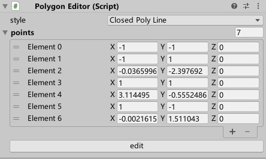
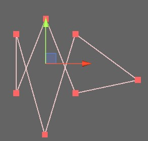

## 概述

PolygonEditor用于可视化地编辑多边形

## Inspector窗口

**style**：绘制多边形的方式

**points**：多边形的各个顶点

**edit**：点击一次进入**编辑状态**，再点击一次退出**编辑状态**

## Scene窗口

按照规定的style绘制多边形

**编辑状态**下，还会绘制多边形的顶点

**编辑状态**下：

- 左键点击一个顶点然后移动来拖拽顶点
- 左键点击一条边然后移动来创建新的顶点
- 右键点击一个顶点来删除顶点