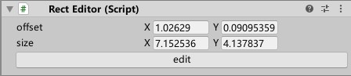
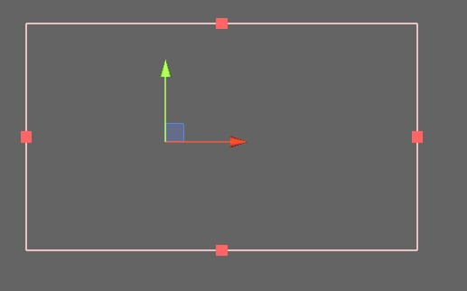

## 概述

RectEditor用于可视化地编辑一个矩形。

## Inspector窗口

**offset**：矩形中心相对于游戏物体的偏移量

**size**：矩形大小

**edit**：点击一次进入**编辑状态**，再点击一次退出**编辑状态**

## Scene窗口

选中脚本所在的游戏物体后，Scene窗口中会显示生成的矩形

**编辑状态**下，还会显示矩形四边的中点

**编辑状态**下：

- 左键点击一条边然后移动来修改矩形

矩形有最小尺寸的限制。比如，如果将右侧的点一直向左拖，将要与左侧的点重合时，左侧的点会左移来确保最小尺寸
